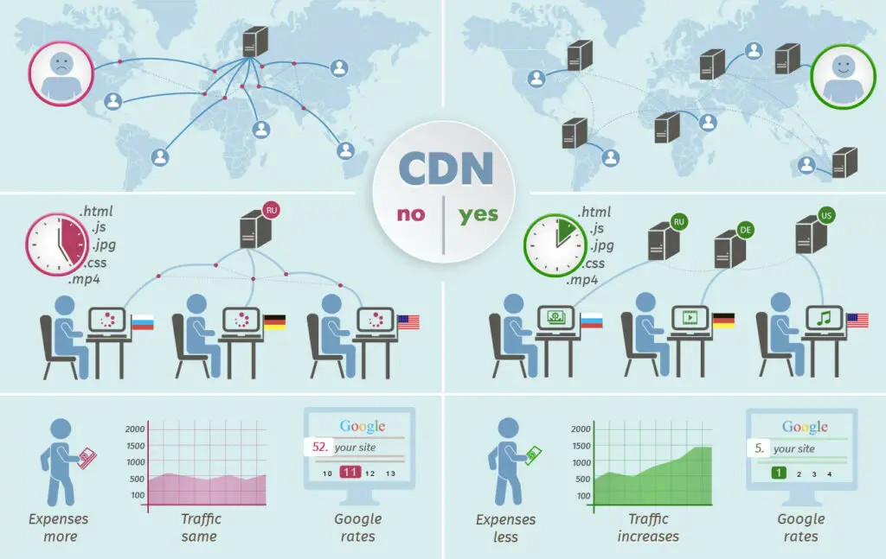

# AWS: S3 and Lambda

## Reading

### [AWS S3](https://aws.amazon.com/s3/)

1. What is Amazon S3?
   * Amazon S3 (Simple Storage Service) is an object storage service provided by Amazon Web Services (AWS), offering scalable storage for data backup, archiving, and content distribution.
   * 

2. Name some use cases for Amazon S3.
   * Data Backup and Recovery: Storing and retrieving backup copies of critical data in a highly durable and available storage solution.
   * Static Website Hosting: Hosting static websites with the ability to serve content globally.
   * Data Archiving: Archiving infrequently accessed data for long-term storage at a lower cost.
   * Content Distribution: Storing and delivering large media files, such as images, videos, and software downloads, to end-users globally.

3. Name some benefits of using Amazon S3.
   * Scalability: S3 can handle any amount of data and scale storage capacity based on demand.
   * Durability and Reliability: It offers 99.999999999% (11 nines) durability for objects and replicates data across multiple geographically diverse locations.
   * Data Security: S3 provides features like access control, encryption, and integration with AWS Identity and Access Management (IAM) for secure data storage.
   * Cost-Effectiveness: S3 offers a pay-as-you-go pricing model with different storage classes optimized for various use cases, allowing cost optimization based on data access patterns.

### [AWS Lambda Basics](https://www.serverless.com/aws-lambda)

1. What is AWS Lambda?
   * AWS Lambda is a serverless compute service provided by AWS, enabling developers to run code without managing servers. It executes code in response to events and automatically scales based on demand.

2. Name some use cases for AWS Lambdas.
   * Serverless Web Applications: Running backend logic for web applications without managing servers, allowing developers to focus on code development.
   * Data Processing and Transformation: Processing and transforming data in real-time or batch jobs, such as resizing images, processing logs, or analyzing data streams.
   * IoT (Internet of Things) Applications: Executing code in response to IoT events, such as device data ingestion or sensor triggers.
   * Microservices: Building and deploying individual functions that can be composed together to create flexible and scalable microservices architectures.

3. Describe “serverless” to a non-technical friend.
   * "Serverless" means that developers can write and deploy code without worrying about the underlying infrastructure. It's like renting a fully managed service where you only pay for the actual code execution. Developers focus on writing functions or code snippets, and the cloud provider takes care of managing servers, scaling, and availability, making it easier to develop and deploy applications with reduced operational overhead.

### [CDN](https://cyberhoot.com/cybrary/content-delivery-network-cdn/)

1. What is a CDN?
   * A CDN (Content Delivery Network) is a geographically distributed network of servers that caches and delivers web content to users based on their geographical location, resulting in faster and more reliable content delivery.
   * [CDN in 5 minutes](https://www.youtube.com/watch?v=Bsq5cKkS33I&t=1s)
   

2. How does a CDN work with relation to the website visitor?
   * With relation to the website visitor, a CDN works by caching website content, such as images, scripts, and static files, in servers located closer to the user's geographical location. When a user requests content from a website, the CDN delivers the content from the nearest server, reducing latency and improving the website's performance.

3. What are the benefits of employing a CDN?
   * Improved Website Performance: By serving content from servers closer to users, a CDN reduces latency and improves the overall speed and responsiveness of websites.
   * Global Content Delivery: CDNs have servers distributed worldwide, allowing websites to serve content to users in different regions with reduced network congestion.
   * Scalability and Reliability: CDNs can handle high traffic loads and distribute the load across multiple servers, ensuring websites can handle increased user demand.
   * DDoS Mitigation: CDNs often provide protection against Distributed Denial of Service (DDoS) attacks, absorbing and filtering malicious traffic before it reaches the website's origin servers.
   * Cost Savings: CDNs can offload bandwidth usage

## [Back](../401readingNotes.md)