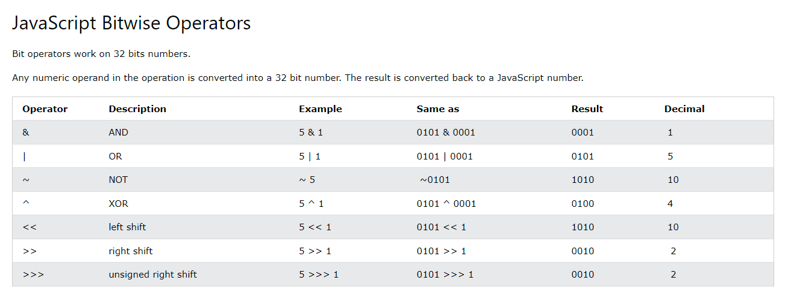

# JS Continued

## Control Flow

Control flow is the order of operations that the computer executes in a script. Think about your favorite movie, it follows the pacing set out for it and goes one scene after another. Imagine if you have a movie where all of the scenes were out of order. The movie wouldn’t make sense and you’d probably get a jumbled mess. This is extremely important for how we follow the chain of logic in a script. Think back to if you ever built legos or Ikea furniture. If you do one of those steps out of order at the beginning of the process, you eventually have to backtrack to figure out where your mistake is and fix it.

Sometimes we use conditional statements to process the script based on variables that occur within the script.Think about one of those pick your own adventure book. You make it to page 34 because of condition A, then you choose condition D and it takes you back to page 23 where you make another choice and follow the resulting things. There were still 4 other options back at Condition A that exist, but because you picked it the script tells you the next page to go to instead of 34.

## What are functions in Javascript

Functions are a set of instructions you give to your code. Think about building a lego set or Ikea furniture and following the instructions brick by brick or dowel by dowel until you end up with what they intended. Functions take some form of input and return an output where you have to help define it.

### Why would we use functions?

We can use functions to run the same process over and over again with thousands of different pieces of information without having to write thousands of lines of code to do it.

To write a function you need to define it by using the literal word `function`. Follow this up with

The name of the function.
A list of parameters to the function, enclosed in parentheses and separated by commas.
The JavaScript statements that define the function, enclosed in curly brackets, `{ /* … */ }`

### How does this work?

Take the below function

```javascript
function square(number) {
  return number * number;
}
```

Here the function called `square` will take the information from `number` and then the instructions on what to do with that say to return the `number * number` or multiply it by itself. We would get that value back from running this function.

We basically have to feed the function information and then tell it what to do with that food once we’ve given it to the function.


When you pass an object as a parameter, if the function changes the object's properties, that change is visible outside the function, as shown in the following example:

```javascript
function myFunc(theObject) {
  theObject.make = 'Toyota';
}

const mycar = {
  make: 'Honda',
  model: 'Accord',
  year: 1998,
};

// x gets the value "Honda"
const x = mycar.make;

// the make property is changed by the function
myFunc(mycar);
// y gets the value "Toyota"
const y = mycar.make;
```

When you pass an array as a parameter, if the function changes any of the array's values, that change is visible outside the function, as shown in the following example:

```javascript
function myFunc(theArr) {
  theArr[0] = 30;
}

const arr = [45];

console.log(arr[0]); // 45
myFunc(arr);
console.log(arr[0]); // 30
```

## Function Expressions

You can define a function by another function. Think of russian nesting dolls and how you are placing one function inside another.

So in this example

```javascript
const square = function (number) {
  return number * number;
}
const x = square(4); // x gets the value 16
```

We are feeding in the information 4 into the function which then spreads that 4 to all the relevant uses of the word ``number``` to give us 16

You can pass multiple parameters into a function to get different information based on different elements.For instance if you feed in that you are 33 years old and the current year is 2022, you can have a function that will take your 33 years(A) and subtract it from the current year 2022(B) to give you your birth year(C) and then return that information.

Using the `return` statement tells that function to stop executing and usually to “return” the information processed back to the functions output.

It is extremely important to make sure you use the ( ) after the function name to run the function otherwise you will return the function object instead of the function result.

## Operators

JavaScript Operators are the different ways we make the data inside a function work. There are several types of operators and some examples of what they look like

### There are different types of JavaScript operators

* Aritmetic Operators
* Assignment Operators
* Comparison Operators
* Logical Operators
* Conditional Operators
* Type Operators

## JavaScript Arithmetic Operators

Arithmetic operators are used to perform arithmetic on numbers

Operator | Description
-------- | ---------
`+` |Addition
`-`| Subtraction
`*`|Multiplication
`**`|Exponentiation (ES2016)
`/`|Division
`%`|Modulus (Division Remainder)
`++`|Increment
`--`|Decrement

## JavaScript Assignment Operators

Assignment operators assign values to JavaScript variables.

Operator | Example | Same As
-----|-----|-----
`=`|x = y|x = y
`+=`|x += y|x = x + y
`-=`|x -= y|x = x - y
`*=`|x*= y|x = x * y
`/=`|x /= y|x = x / y
`%=`|x %= y|x = x % y
`**=`|x **= y|x = x ** y

## JavaScript Comparison Operators

Operator | Description
-----| -----
`==`|equal to
`===`|equal value and equal type
`!=`|not equal
`!==`|not equal value or not equal type
`>`|greater than
`<`|less than
`>=`|greater than or equal to
`<=`|less than or equal to
`?`|ternary operator

## JavaScript Logical Operators

Operator | Description
----- | ------
`&&`|logical and
`||`|logical or
`!`|logical not

## JavaScript Type Operators

Operator | Description
-----| ------
`typeof`|Returns the type of a variable
`instanceof`|Returns true if an object is an instance of an object type

## JavaScript Bitwise Operators

Bit operators work on 32 bits numbers.
Any numeric operand in the operation is converted into a 32 bit number. The result is converted back to a JavaScript number.



## Assignment operators

An assignment operator assigns a value to its left operand based on the value of its right operand. The simple assignment operator is equal (=), which assigns the value of its right operand to its left operand. That is, x = f() is an assignment expression that assigns the value of f() to x.

There are also compound assignment operators that are shorthand for the operations listed in the following table:

